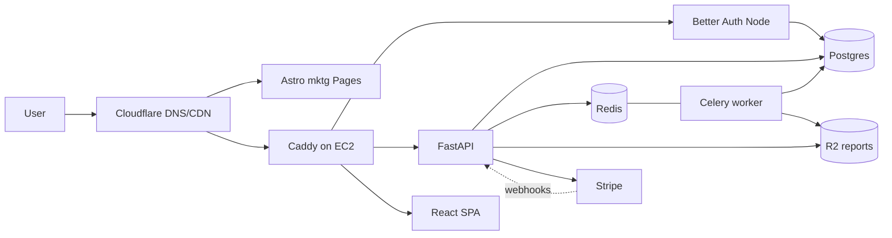
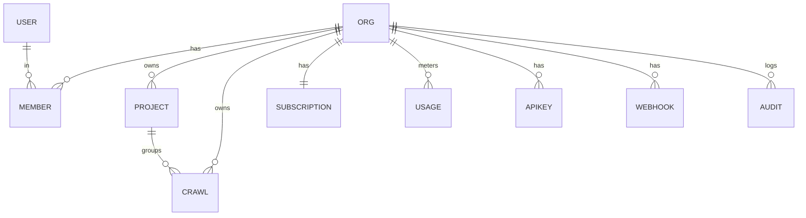

# LinkCanary: GitHub Tool → Paid SaaS — Migration Spec (v1)

> Scope of this document: the plan to take LinkCanary from an open-source,
> self-hosted tool to a paid, multi-tenant SaaS. **v1 monetizes the existing
> one-shot crawl/audit tool**; continuous monitoring is v2.

## 0. Decisions (locked)
- **v1 scope:** monetize the **existing one-shot crawl/audit tool** with auth + billing + usage limits. Continuous monitoring (30s/multi-region/uptime/incidents) = **v2**.
- **Auth:** **Better Auth** (TypeScript) as a small **Node service**, users/sessions in shared Postgres; FastAPI validates Better Auth **JWTs**.
- **DB:** **PostgreSQL only** for v1 (system-of-record). **Link-graph / Neo4j features deferred to v2.**
- **Compute:** **single AWS EC2 ARM box** running **Docker Compose**; **Caddy** for origin TLS. **Cloudflare** in front (DNS/CDN/WAF) and **Cloudflare R2** for report files (S3-compatible, zero egress).
- **Billing:** **Stripe Billing** (Checkout + Customer Portal + webhooks).

## 1. Target architecture

One EC2 instance runs Docker Compose services: `caddy`, `app-api` (FastAPI),
`worker` (Celery), `beat` (Celery Beat for retention/usage-reset jobs), `auth`
(Better Auth/Node), `postgres`, `redis`. The SPA is static (served by Caddy or
the API). R2 + Stripe are external. An EBS volume holds Postgres/Redis data;
nightly `pg_dump` is shipped to R2.

## 2. Data model (Postgres)

- **Better Auth owns** `user`, `session`, `account`, `verification` (its Postgres adapter).
- **New app tables:** `organizations` (`stripe_customer_id`, `plan`), `memberships` (org_id, user_id, role), `projects`, `subscriptions` (Stripe sub id/status/period_end), `usage_counters` (org_id, period, metric, count), `api_keys` (hashed), `audit_log`.
- **Modify existing** (`crawls`, `webhooks`): add `org_id`, `project_id`, `created_by`; index by `org_id`. Existing local SQLite data is dev-only → fresh Postgres start.
- Crawl link relationships continue to live in the **report files (R2)** + Postgres metadata, exactly as today (no graph DB in v1).

## 3. Auth integration (Better Auth + FastAPI)
- Node `auth` service mounted at `/auth/*` behind Caddy; email/password + Google/GitHub OAuth + email verification + password reset; persists to Postgres.
- Enable Better Auth **JWT plugin** + JWKS. Login sets an httpOnly cookie on `app.linkcanary.io` and issues a JWT.
- **FastAPI `get_current_user`:** verify JWT (signature/expiry via JWKS), load `user`, resolve active **org + role** from `memberships` → inject `RequestContext{user, org_id, role}`.
- React app uses Better Auth's client/hooks for the login UI and sends credentials with API calls.

## 4. Multi-tenancy
- All `/api/*` routes require auth and are **scoped by `org_id`**; every query filtered by `org_id` via a shared dependency/repository helper. Role checks (owner/admin/member) gate destructive + billing actions.

## 5. Billing + usage limits
> Enforces plan caps — this is what solves the "can't stop a user after 50 checks" problem.

- **Stripe:** Products/Prices for Hatchling (free) / Songbird / Flock (monthly + yearly); Checkout for upgrades; Customer Portal for self-serve.
- **Webhook** (`/api/billing/webhook`, signature-verified, unauthenticated): handle `checkout.session.completed`, `customer.subscription.updated|deleted`, `invoice.paid|payment_failed` → update `subscriptions` + `organizations.plan`.
- **Plan limits** (config in code): crawls/period, max pages per crawl, report retention, seats, API access.
- **Enforcement dependency:** before starting a crawl, compare `usage_counters` to the org's plan; return `402` + upgrade prompt when exceeded; increment on use; Celery Beat resets per billing period.

## 6. API changes
- Protect all existing routers with auth + org scoping.
- New routers: `/api/account` (org, members, plan, usage), `/api/billing` (checkout/portal/webhook), `/api/api-keys`.
- Keep `/health`; add per-org rate limiting via Redis.

## 7. Frontend (React SPA) changes
- Auth pages (login/signup/OAuth callback) via Better Auth React; route guard redirects unauthenticated users to login.
- Account / team / billing / usage pages; upgrade → Stripe Checkout, manage → Customer Portal; show plan limits + current usage.
- Crawl screens gain project association + tenancy.

## 8. Persistence migration (SQLite→Postgres, files→R2, threads→Celery)
- Add **Alembic** migrations; create all tables.
- `db_url` → Postgres (`asyncpg` for API, sync driver for worker).
- Replace local filesystem report writes with **Cloudflare R2** via the S3 API (boto3, R2 endpoint); store object keys in `crawls.report_csv_path/html_path`; serve via presigned URLs.
- Set `LINKCANARY_USE_CELERY=true`; run `worker`/`beat` on Redis; retire the in-process threading path.

## 9. Infrastructure, cost & ops
- **1× EC2 ARM (t4g.small/medium)** + EBS (~40GB); **Cloudflare** DNS/CDN/WAF (free tier) proxying to the box; **Caddy** origin TLS (Full-Strict); **R2** bucket for reports.
- Secrets via `.env` on box or **SSM Parameter Store**; nightly `pg_dump` → R2; container logs + `/health`; optional Sentry.
- **Estimated cost at launch:** ~**$30-60/mo** infra (EC2 + EBS + tiny R2/DNS). Better Auth, Postgres, Redis, Caddy are **free/self-hosted**; Stripe charges 2.9% + 30¢ **only per transaction**.
- **Maintenance effort:** single box = you own OS patching, Docker, DB upgrades, backups (modest). Caddy auto-renews TLS.
- **Scale-up path (documented, not built):** Postgres → RDS, add ALB + Auto Scaling or ECS Fargate, dedicated worker instances; later multi-region workers for v2 monitoring.

### Cost summary

| Item | AWS EC2 path (chosen) | Notes |
|---|---|---|
| Compute (1 box, ~4-8GB RAM) | t4g.medium ~$24 (≈$15 reserved) | hosts API + worker + Postgres + Redis + auth |
| Disk (EBS 40GB gp3) | ~$4 | DB + Redis data |
| Object storage (reports) | Cloudflare R2 ~$0-2 | zero egress fees |
| DNS / TLS / CDN | Cloudflare free + Caddy | origin TLS via Caddy |
| **Infra subtotal** | **~$30-60/mo** | low-traffic launch |
| Stripe | 2.9% + 30¢ per transaction | only on revenue |
| Better Auth / Postgres / Redis / Caddy | $0 | self-hosted, open source |

## 10. Phased roadmap
- **Phase 0 — Infra foundation:** docker-compose skeleton (Caddy/Postgres/Redis/API/worker/auth), Cloudflare DNS+proxy, R2 bucket, domains, secrets, Alembic, CI.
- **Phase 1 — Persistence swap:** SQLite→Postgres, files→R2, threading→Celery; existing crawl/report features green.
- **Phase 2 — Auth + multi-tenancy:** Better Auth service, FastAPI JWT dependency, org/membership models, scope all data, SPA login + guards.
- **Phase 3 — Billing + limits:** Stripe products/checkout/portal/webhooks, plans + enforcement, account/usage UI.
- **Phase 4 — Launch hardening:** backups, rate limiting, security review, repoint marketing "Start free" CTAs from the repo to `app.linkcanary.io/signup`, beta → GA.
- **v2 (post-launch):** continuous-monitoring engine (scheduler/uptime/SSL/incidents/multi-region) **and** link-graph features (Neo4j or Apache AGE).

## 11. Key risks / call-outs
- **Polyglot stack** (Python + Node auth): one extra container; mitigated by shared Postgres + stateless JWT verification.
- **Single box = SPOF:** acceptable for v1/beta; backups + documented scale-up path mitigate.
- **Marketing mismatch:** the live site advertises continuous monitoring; v1 sells the audit tool — adjust landing copy or set expectations before GA.

## Appendix A — Current system (starting point)
- **`link_checker/`** — MIT Python engine: sitemap parsing, page crawling, link checking, redirect/SSL logic, HTML/CSV reporters, webhook dispatcher. Reusable core.
- **`linkcanary-ui/`** — single-tenant FastAPI + React app: FastAPI, SQLAlchemy async on **SQLite** (`~/.linkcanary/linkcanary.db`), reports on local filesystem, background work via in-process **threads** (Celery+Redis scaffolding exists, off by default), React 19 + Vite + react-router + Tailwind v4 SPA served as static files. **No users/auth/orgs/billing.**
- **`site/`** — Astro marketing page (deployed to Cloudflare Pages).
